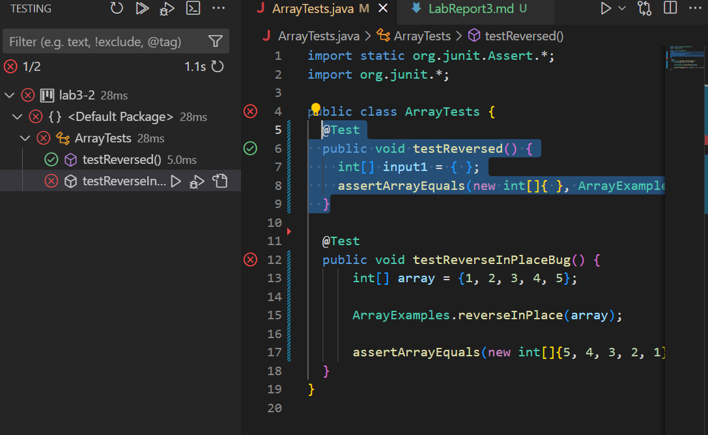

# Lab Report 3

**Part 1**

**Bug Description**

In the ArrayExamples.java code, I discovered a bug in the reverseInPlace method. This bug prevented the method from correctly reversing the elements of an array in place.

<br>

**Failure-Inducing Input**

I created a JUnit test to trigger the bug in the reverseInPlace method. The test aims to reverse an array and checks if the result matches the expected reversed order.

```java
@Test
  public void testReverseInPlaceBug() {
      int[] array = {1, 2, 3, 4, 5};
      
      ArrayExamples.reverseInPlace(array);
      
      assertArrayEquals(new int[]{5, 4, 3, 2,  1}, array);
  }
```

**Input not inducing failure**

```java
@Test
  public void testReversed() {
    int[] input1 = { };
    assertArrayEquals(new int[]{ }, ArrayExamples.reversed(input1));
  }
```
<br>

**Symptoms (Output of JUnit tests)**




**Original buggy code**

```java
  static void reverseInPlace(int[] arr) {
    for(int i = 0; i < arr.length; i += 1) {
      arr[i] = arr[arr.length - i - 1];
    }
  }
```

**Updated fixed code**

```java
public static void reverseInPlace(int[] array) {
    int length = array.length;
    for (int i = 0; i < length / 2; i++) {
        int temp = array[i];
        array[i] = array[length - 1 - i];
        array[length - 1 - i] = temp;
    }
}
```
The bug in the original code was in the reverseInPlace method's loop condition and the array indexing. The original code didn't handle arrays with an odd number of elements correctly. The bug was fixed by adjusting the loop condition and using a separate variable to store the array's length, ensuring that the array gets reversed in place properly.


<br>

**Part 2**

I have detailed four of the alternatives for the 'find' command


**-type option:**

The -type option allows you to specify the type of file or directory to search for. You can use it to filter by file type, such as regular files (f) or directories (d).

Find all regular files in the current directory and its subdirectories:
```java
find ./technical -type f
```

Find all directories in the current directory and its subdirectories:
```java
find ./technical -type d
```

<br>

**-name option:**

The -name option lets you search for files or directories with specific names or patterns, using wildcards like * and ?.

Find all files with names starting with "file" in the current directory and its subdirectories:
```java
find ./technical -name "file*"
```

Find all files with a .txt extension in the current directory and its subdirectories:
```java
find ./technical -name "*.txt"
```
<br>

**-mtime option:**

The -mtime option allows you to search for files based on their modification time. You can specify the number of days ago the file was modified.

Find all files modified within the last 7 days in the current directory and its subdirectories:
```java
find ./technical -type f -mtime -7
```

Find all files modified more than 30 days ago in the current directory and its subdirectories:
```java
find ./technical -type f -mtime +30
```

<br>

**-exec option:**

The -exec option allows you to perform actions on the files or directories found by find. You can execute shell commands on the found items.

Find and delete all files with a .bak extension in the current directory and its subdirectories:
```java
find ./technical -type f -name "*.bak" -exec rm {} \;
```

Find and compress all .log files in the current directory and its subdirectories into gzip format:
```java
find ./technical -type f -name "*.log" -exec gzip {} \;
```

**Section of lab report acknowledging ChatGPT usage**

For Part 2 of the lab report, I utilised ChatGPT to discover command line options for find.

This was the first prompt I put:

'give me some command line options for find'

This was the output:

'The `find` command is a powerful tool for searching for files and directories in a Unix-like operating system. It can be used with various command line options to customize and refine your search. Here are some common command line options for the `find` command:

1. `-name pattern`: Search for files and directories with names that match the specified pattern. You can use wildcards (e.g., `*.txt`) for pattern matching.

2. `-type type`: Filter the search results based on the type of file or directory. Common values for "type" include:
   - `f`: Regular files
   - `d`: Directories
   - `l`: Symbolic links

3. `-maxdepth level` and `-mindepth level`: Specify the maximum and minimum directory depth for the search. For example, you can use `-maxdepth 2` to limit the search to files and directories within the top two levels.

4. `-size size`: Search for files based on their size. You can specify the size in bytes, with optional suffixes such as "k" (kilobytes) and "M" (megabytes). For example, `-size +1M` finds files larger than 1 megabyte.

5. `-mtime days`: Search for files based on their modification time. You can specify the number of days ago the file was modified. Use `-mtime -n` to find files modified more than "n" days ago, and `-mtime +n` to find files modified less than "n" days ago.

6. `-user username` and `-group groupname`: Search for files owned by a specific user or group.

7. `-exec command {} \;`: Execute a command on each file or directory found by `find`. Replace `{}` with the found file or directory. For example, you can use `-exec ls -l {} \;` to list the details of each file found.

8. `-delete`: Delete the files and directories that match the search criteria. Be cautious when using this option, as it will remove files without confirmation.

9. `-print`: Display the paths of the files and directories that match the search criteria. This is the default action if no other action is specified.

10. `-iname pattern`: Perform a case-insensitive search for files and directories with names that match the specified pattern.

11. `-regex pattern`: Search for files and directories using regular expressions.

12. `-not`: Invert the sense of the test. For example, you can use `! -name "*.txt"` to exclude files with the ".txt" extension.

These are some of the common options for the `find` command, but there are many more available. You can use these options in combination to create complex and customized searches for files and directories on your system. Make sure to consult the `man` page for `find` (`man find`) for a full list of options and more detailed information.'

This prompt gave me a lot of information. I did not fully understand all of it so I chose to use four of the command line options I did understand: -type, -name, -mtime, and -exec. 